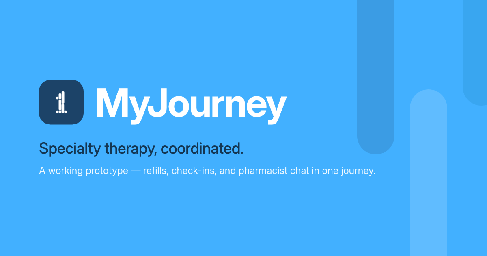
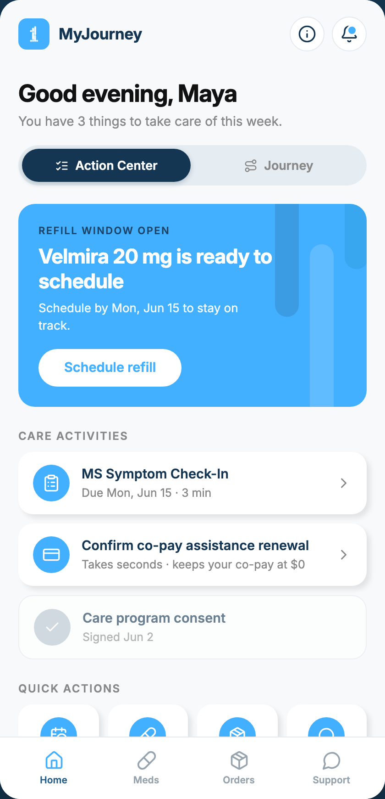
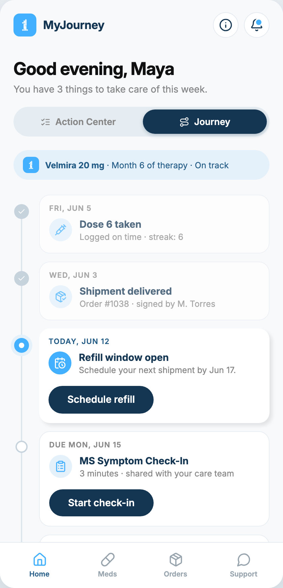
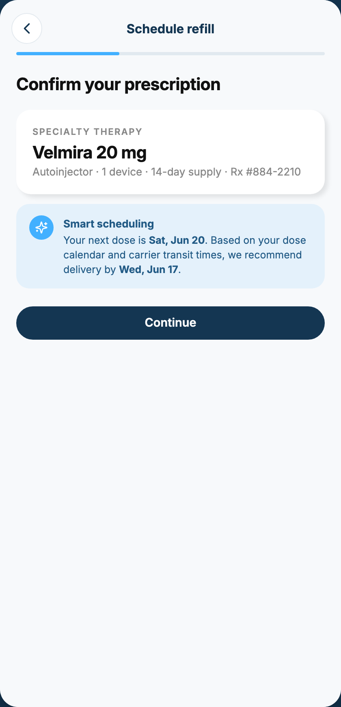

<p align="center">
  
</p>

# MyJourney

<p>
  <a href="https://github.com/sethatwood/myjourney/actions/workflows/ci.yml"></a>
  
  
  
</p>

**A working specialty-patient coordination app.** Maya Torres is six months into a specialty therapy for MS — MyJourney is the app that keeps her refills, symptom check-ins, co-pay assistance, and pharmacist in one coordinated place.

**Live demo: [myjourney.help](https://myjourney.help)** — no login, works on desktop and phone, every flow completes end-to-end.

| Action Center | Journey | Smart scheduling |
|:---:|:---:|:---:|
|  |  |  |

## One dataset, two cognitive modalities

The home screen is the thesis. The same patient state renders under two framings, and the toggle is the most prominent control in the app:

- **Action Center** answers *"what do I do next?"* — task-led, for people who process by completing.
- **Journey** answers *"where am I in the arc of my therapy?"* — timeline-led, for people who process by orienting.

The split is inspired by [GenderMag](https://gendermag.org/), Margaret Burnett's inclusive-design method built on a finding that holds well beyond gender: people differ systematically in how they process information toward a goal — some act task-by-task, others build a comprehensive picture before acting — and an interface silently optimized for one style quietly fails the other. Here both styles get a first-class home, and the preference persists per patient. Everything else — heroes, tasks, timeline nodes, the notification badge — derives from one store, so completing a task anywhere updates everywhere.

## What's real vs. simulated

Real:

- All three care tasks (refill scheduling, MS symptom check-in, co-pay renewal) and the pharmacist chat complete end-to-end and **persist across refresh** (localStorage).
- Every date is **derived from the day you visit**, so the scenario always reads current: the refill window opened this morning, the next dose is eight days out.
- Clean-profile safe: first visit with no stored state renders the full scenario; "Reset demo data" (the info overlay in the app bar) restores it.

Simulated:

- Auth, APIs, and the patient herself. **Velmira 20 mg is a fictional therapy.**
- The "smart scheduling" recommendation is copy — in production it's a service reconciling the dose calendar against carrier transit times.
- The pharmacist's reply is canned (every check-in deserves a response, even in a demo).

## Stack

- **Vite + React 18 + TypeScript**, strict mode. No state library: a 60-line external store on `useSyncExternalStore` with localStorage persistence.
- **State-based routing** — a route string in app state. One document, no router dependency, no 404s on static hosts.
- **Design system as plain CSS**: tokens and brand classes derived from the ONE Journey design language (Journey Blue as accent only, Inter, pill buttons with the sweep hover, hairlines over shadows). Self-hosted variable fonts.
- **lucide-react** line icons at `strokeWidth 2`, per the brand's iconography rules.

## Tests and CI/CD

- **Unit tests (Mocha/Chai)** cover the store contract and the date-derivation module.
- **E2E tests (Playwright)** drive every flow on desktop Chromium *and* iPhone-profile WebKit: full refill round-trip, check-in, co-pay, chat reply, persistence across reloads, reset, and a zero-console-error assertion on every test.
- **GitHub Actions** runs both suites on every push and pull request. A push to `main` deploys to the live server (Laravel Forge) **only after the suite is green** — a red build never ships.

```
npm install        # setup
npm run dev        # local dev server
npm test           # unit tests
npm run test:e2e   # Playwright suite (also regenerates docs/ screenshots)
npm run build      # type-check + production build
```

## How this ships for real

The demo is deliberately front-end-only, but it's shaped for the system behind it: order lifecycle as an explicit state machine (confirmed → filled → shipped → delivered) with event-driven notifications; care activities as a task queue evaluated against the clinical pathway; FHIR-friendly resource shapes for medications, orders, and questionnaire responses; a Node API over Postgres. The store's state shape is the contract a `GET/PATCH /api/state` would honor.

## Provenance

Built by **Seth Atwood** as a working conversation-starter in the specialty-pharmacy coordination space. AI assistance (Claude Code) was used as a force-multiplier for the build-out and test scaffolding; the product thinking, design decisions, and architecture are mine. The visual language is derived from the public ONE Journey site as a deliberate exercise in designing inside an existing brand; all trademarks belong to their owners. The patient, therapy, and clinical content are fictional.
